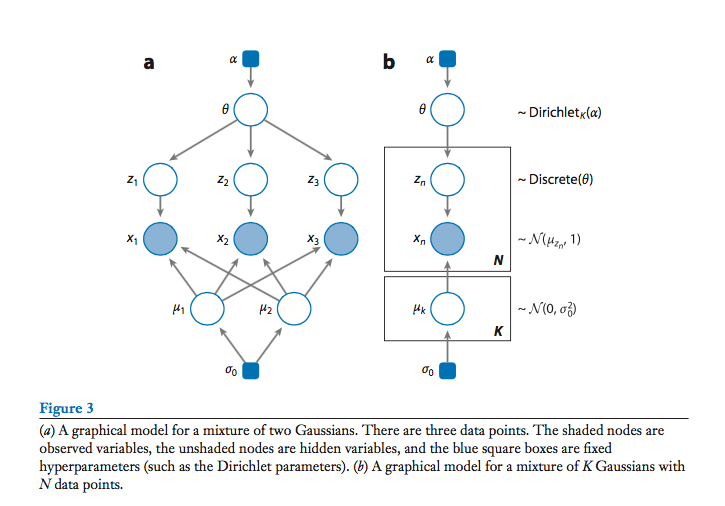
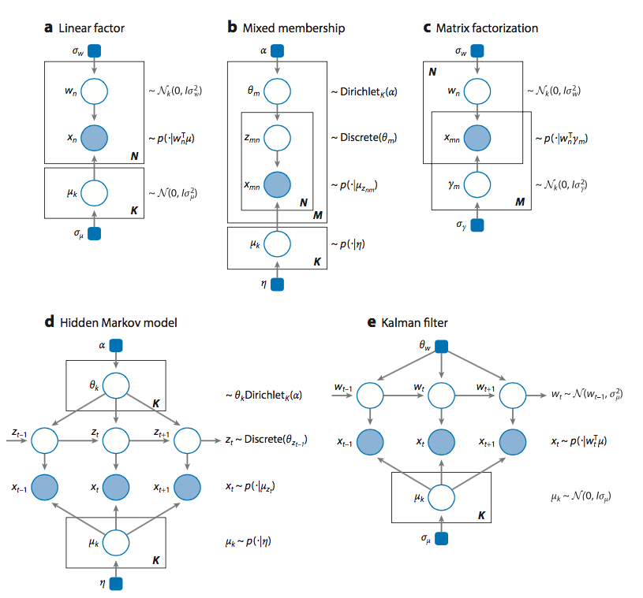

# Latent Variables

## Parameters are Latent Variables too

The tutorial for `edwardlib` describes the structure of latent variables very well. Here the latent variable $\mathbf{z}$ can be a set of parameters in a bayesian context, or some factors that are being used to explain a phenomenon.

Quoting the tutorial:

> A probabilistic model asserts how observations from a natural phenomenon arise. The model is a *joint distribution*

$$
\begin{aligned} 

p(\mathbf{x}, \mathbf{z})

\end{aligned}
$$

> of observed variables $\mathbf{x}$ corresponding to data, and latent variables $\mathbf{z}$ that provide the hidden structure to generate from $\mathbf{x}$. The joint distribution factorizes into two components.

> The *likelihood*

$$
\begin{aligned} p(\mathbf{x} \mid \mathbf{z})\end{aligned}
$$

> is a probability distribution that describes how any data $\mathbf{x}$ depend on the latent variables $\mathbf{z}$. **The likelihood posits a data generating process, where the data $\mathbf{x}$ are assumed drawn from the likelihood conditioned on a particular hidden pattern described by $\mathbf{z}$.**

> The *prior*

$$
\begin{aligned} p(\mathbf{z})\end{aligned}
$$

> is a probability distribution that describes the latent variables present in the data. **The prior posits a generating process of the hidden structure.**

## Other latent variable Models

We've seen lots of bayesian models with this structure. Lets see some more where the hidden variables correspond to some unknown or unexplainable latent features in the model. In clustering, and more generally classification based learning, this could be the cluster "class". 

The following diagrams, taken from Blei, illustrate many models with hiddenvariables:

Lets focus on a single example, which can be easily gibbs-sampled:

## Recommendations: The Latent Factor Model

There are two primary approaches to recommendations: neighboorhood and latent factor model. The former is concerned with computing the relationships between items or between users. In the latter approach you have a model of hidden factors through which users and items are transformed to the same space. For example, if you are rating movies we may transform items into genre factors, and users into their preference for a particular genre.

Factor models generally lead to more accurate recommenders. One of the reasons for this is the sparsity of the item-user matrix. Most users tend to rate barely one or two items. Latent factor models are more expressive, and fit fewer parameters.

### Model Overview

The central dogma in constructing a recommendation system using collaborative filtering is that *similar users will rate similar restaurants similarly*. In the previous section, we explicitly encoded this idea by using a similarity function to identify similar restaurants. We also assumed that either all users were the same (the global approach) or that only the current user was similar enough to make a recommendation (the user-specific approach). In this section, we will use a model that allows us to identify both similar users and similar restaurants as a function of **latent factors**.

We can think of latent factors as properties of restaurants (e.g., spiciness of food or price) that users have a positive or negative preference for. We do not observe these factors or the users' preferences directly, but we assume that they affect how users tend to rate restaurants. For example, if a restaurant serves a lot of spicy food and a user dislikes spicy food, then the restaurant would have a high "spiciness" factor, and the user would have a strongly negative preference, resulting in a prediction of a low rating. Note that if users have similar preferences, then according to the model, they will behave similarly, and likewise, if restaurants have similar latent factors, they will be rated similarly by similar users. Latent factors thus give us an intuitive way to specify a generative model the obeys the central dogma.

One issue that comes up with latent factor models is determining how many latent factors to include. There may be a number of different unmeasured properties that affect ratings in different ways -- for example, in addition to the spiciness factor above, there may also be a price factor that affects how users rate a restaurant. We deal with the problem of choosing the number of latent factors to include in the same way we deal with choosing KK in a KK-nearest neighbors problem.

### Rating Model Specification

To make this model concrete, we can write down our probability model as a generative process. First, we define the following quantities:

Counts:

* $L$: The number of latent factors.

* $U$: The number of users.

* $M$: The number of items (restaurants).

* $N$: The number of observed ratings.

Data:

* $Y_{um}$: The star rating given to restaurant $m$ by user $u$.
* $Y$: The full collection of observed star ratings.

Item-specific quantities:

* $\gamma_m$: An item-specific parameter vector of length $L+1$. The first element of $\gamma_m$, denoted $\gamma_m[0]$ is the item-specific bias. The remaining $L$ elements of $\gamma_m$, denoted $\gamma_m[1:]$, are the latent factors associated with item $m$.

* $\Gamma$: An $M$ by $L+1$ matrix where the $m$th row is $\gamma_m$.

User-specific quantities:

* $\theta_u$: A user-specific parameter vector of length $L+1$. The first element of $\theta_u$, denoted $\theta_u[0]$ is the user-specific bias. The remaining $L$ elements of $\theta_u$, denoted $\theta_u[1:]$, are user $u$'s preferences for the latent factors.

* $\Theta$: A $U$ by $L+1$ matrix where the $u$th row is $\theta_u$.

Global quantities:

* $\mu$: The overall ratings mean.
* $\sigma​$: The residual variance of ratings after the mean, bias terms, and latent factors have been taken into account.

Using these quantities, we can specify our model for each rating $Y_{um}$ similarly to a linear regression:

$$Y_{um} = \mu + \theta_{u}[0] + \gamma_{m}[0] + \theta_{u}[1:]^{\top}\gamma_{m}[1:] + \epsilon_{um}$$

where

$$\epsilon_{um} \sim N(0, \sigma).$$

Note that while this looks like a linear regression, it is of a slightly different form because the latent factor term involves the product of two unknowns. This is like a linear regression where we forgot to measure some covariates.

We also assume the following priors on the user-specific and item-specific parameters:
$$
\begin{align*}

\gamma_m &\sim MVN(\mathbf 0, \Lambda_\gamma^{-1})\\
\theta_u &\sim MVN(\mathbf 0, \Lambda_\theta^{-1}),
\end{align*}
$$
where $MVN$ means multivariate normal, $\mathbf 0$ is vector of length $L+1$ filled with zeros, and $\Lambda_\theta^{-1}$ and $\Lambda_\gamma^{-1}$ are $L+1 \times L+1$ covariance matrices.

Using this model, we want to make inference about all of the quantities that, if we knew them, would allow us to sample $Y_{um}$ for any user and any item. These quantities are $\mu$, $\sigma$, and the elements of $\Theta$ and $\Gamma$.